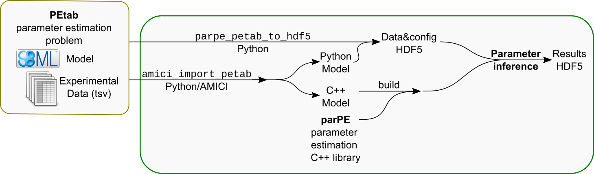

# Parameter estimation for *PEtab* models using *parPE*


## Introduction

This document describes how to setup and use parPE to estimate parameters for
a model in the PEtab format. This is currently the most streamlined use case
parPE.

[PEtab](https://github.com/ICB-DCM/PEtab) is a convention to specify systems
biology parameter estimation problems in a machine-readable way. It is based
on [SBML](http://sbml.org/) models and a set of tab-separated values files.
If you already have an SBML model, it should be rather easy to generate a set
of PEtab files. Further information and a detailed format description are
provided in the PEtab repository.

For testing purposes, you can also use the example shipped with PEtab
[../examples/parpeamici/steadystate/](../examples/parpeamici/steadystate/)
or a model from the collection of
[Benchmark Problems for Dynamic Modeling of Intracellular Processes](https://github.com/LoosC/Benchmark-Models/).


## Workflow overview

A rough overview of the workflow for setting up and using parPE to optimize
a PEtab-based problem is provided in the following figure:



The principal steps are:

1. Building parPE as described in the [documentation](../README.md)

2. Generating model C++ code and Python module (using `amici_import_petab.py`
   from [AMICI](https://github.com/ICB-DCM/AMICI/))

3. Setting up a project for building parameter estimation (and other)
   executables for the given model
   (using [../misc/setup_amici_model.sh](../misc/setup_amici_model.sh))

4. Generating an HDF5 input file for parPE with data and options for parameter
   estimation based on the PEtab problem definition (using
   [../misc/generateHDF5DataFileFromText.py](../misc/generateHDF5DataFileFromText.py))

5. Running the desired optimization and further analysis

Any of these steps can be adapted to your specific needs. This document will
present the simplest use case.

NOTE: This workflow is to be simplified and converted to a configurable
[Snakemake-based](https://snakemake.readthedocs.io/en/stable/) workflow. A
scaffold is provided in [../snakemake/](../snakemake/).
As for the overall project: contributions are welcome.


## Notation

To not rely on a specific model, we will use generic artifact names throughout
this document. They will be written as some `${SOME_ARTIFACT}`, so that
you just copy any commands after setting the respective shell variable to your
required values.

We will refer to the following artifacts:

- `${PETAB_SBML_MODEL}`: The PEtab-coherent SBML model for which for perform
  parameter estimation

- `${PETAB_CONDITION_FILE}`: The PEtab TSV file defining simulation/experimental
  conditions

- `${PETAB_MEASUREMENT_FILE}`: The PEtab TSV file with measurements / training
  data

- `${PETAB_PARAMETER_FILE}`: The PEtab TSV file listing optimization parameters,
  bounds, etc.

- `${AMICI_MODEL_DIR}`: Output directory to be created where AMICI model code
  will be written to

- `${MODEL_NAME}`: Any name for the model

- `${PARPE_SOURCE_ROOT}`: Path to the parPE repository root directory

- `${PARPE_MODEL_DIR}`: Project directory for generating model-specific
  parameter estimation executables. Will be created, must not exist.

- `${ESTIMATE}`: Generated parameter estimation executable, see below

- `${H5_PE_INPUT}`: Generated HDF5 file for input to parameter estimation 
  executable, see below


## Building PEtab

Build parPE as described in the [documentation](../README.md).


## Model processing

Although generally any kind of model can be used with parPE after, we will only
describe the simplest case of using [AMICI](https://github.com/ICB-DCM/AMICI/)
models.
We assume that there already a set of PEtab files with the problem definition.
(This is not strictly necessary for using parPE, but will require significant
additional effort).

We will use the `amici_import_petab.py` helper script for generating AMICI C++
files and Python package for the respective model. After installing AMICI, this
script should be added to your PATH automatically. If not, adapt the paths in
this example accordingly.

*NOTE*: Use the AMICI version shipped with parPE (`deps/AMICI`). Do not try to
mix different versions of AMICI-generated models and AMICI base files. This
will likely lead to crashes and/or undefined behaviour.

Run:

```shell
amici_import_petab.py -o ${AMICI_MODEL_DIR} \
                      -n ${MODEL_NAME} \
                      -s ${PETAB_SBML_MODEL} \
                      -m ${PETAB_MEASUREMENT_FILE} \
                      -c ${PETAB_CONDITION_FILE} \
                      -p ${PETAB_PARAMETER_FILE}
```

Which will create `${AMICI_MODEL_DIR}` containing model C++ files and a Python
package for the model.

Run `amici_import_petab.py -h` for further command line options.


## Building parameter estimation executable

Next we need to create a new project to build the executables for parameter
estimation. The `misc/setup_amici_model.sh` script will do that, using the
C++ code generated by AMICI. It will adapt some templates for `main.cpp` files
and will build the targets using CMake:

```shell
${PARPE_SOURCE_ROOT}/misc/setup_amici_model.sh ${AMICI_MODEL_DIR} ${PARPE_MODEL_DIR}
```

After that, among other files, there should now exist an executable
`${PARPE_MODEL_DIR}/build/estimate${MODEL_NAME}` which will be used in the
second next step.

To simplify notation:

```shell
export ESTIMATE=${PARPE_MODEL_DIR}/build/estimate${MODEL_NAME}
```

## Generating in HDF5 input file for parPE parameter optimization

The default workflow requires a training data and optimization options to be
provided in an HDF5 file. Based on the PEtab problem definition we can simply
create this using
[../misc/generateHDF5DataFileFromText.py](../misc/generateHDF5DataFileFromText.py):

```shell
    ${PARPE_SOURCE_ROOT}/misc/generateHDF5DataFileFromText.py \
        -n ${MODEL_NAME} \
        -s ${PETAB_SBML_MODEL} \
        -m ${PETAB_MEASUREMENT_FILE} \
        -c ${PETAB_CONDITION_FILE} \
        -p ${PETAB_PARAMETER_FILE} \
        -d ${AMICI_MODEL_DIR} \
        -o ${H5_PE_INPUT}
```

This should create `${H5_PE_INPUT}`. The file format is described in
[hdf5.md](hdf5.md) This file will contain some default
settings. Those can be adapted using hdfview, your programming language of
choice, or from the command line using
[../misc/optimizationOptions.py](../misc/optimizationOptions.py) (`-h` for
usage information).

To inspect the default settings, run:

```shell
${PARPE_SOURCE_ROOT}/misc/optimizationOptions.py ${H5_PE_INPUT}
```

## Running parameter optimization and further analyses

For running parameter estimation with default settings on a single node, run:

```shell
    ${ESTIMATE} -o test_output_dir/ ${H5_PE_INPUT}
```

Note that, depending on your model and data, this might take a long time.
The results will be written to HDF5 files in `test_output_dir/`. The output
format is described in [hdf5.md](hdf5.md).

Usage of the generated executable is described in more depth, for example, in
the Jupyter notebooks in
[../examples/parpeamici/steadystate/](../examples/parpeamici/steadystate/).
These notebooks also demonstrate the use of other executables created earlier
and show examples for data analysis using the parPE Python package.
